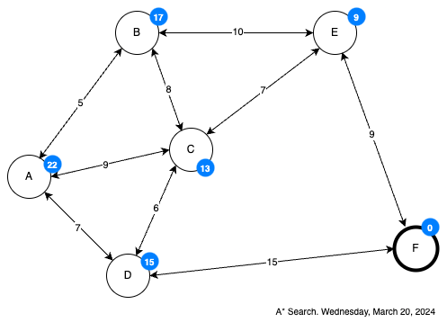

Y entonces llega A* (A estrella), un método de búsqueda informada que toma la decisión de a que estado cambiar a continuación basándose en ambos, el costo de un estado y su valor heurístico.

$f(g)=g(q)+h(q)$

Así que para A* el siguiente estado a visitar es aquel que optimice su utilidad:

$\textrm{next}=\textrm{argMaxQ}\begin{Bmatrix} f(g)=g(q)+h(q)\end{Bmatrix} \forall q \in b(q)$

Tanto en la bísqueda *primero por lo mejor*, como en la búsqueda *heurística* y ahora en *A** estamos "prefiriento el estado que optimice su utilidad, es decir:

$\textrm{next}=\textrm{argMaxQ}\begin{Bmatrix} f(g)\end{Bmatrix} \forall q \in \textrm{opened}$

Y sin embargo, a la hora de implementar los métodos, siempre elegimos al estado que:
1. O minimice el costo (en primero por lo mejor)
2. O minimice el valor heurístico (en busqueda avara).

¿No es una contradicción? En realidad no, la razón es simple:
- El costo de un estado normalmente es algo que queremos minimizar
- Y el valor heurístico de un estado entendido como su distancia hasta la meta, es algo que queremos minimizar.

Así que cuando se habla del mejor estado como aquel que optimiza su utilidad, todo dependerá de a que le llamamos "óptimo", así que desde el punto de vista del costo, el "óptimo" es el más barato, y desde el punto de vista de la distancia a la meta el más cercano es el óptimo. Por eso:

a. En la búsqueda primero por lo mejor:

$\textrm{next} = \textrm{argMaxQ}\begin{Bmatrix} f(g)=g(q)\end{Bmatrix} = \textrm{argMinQ}\begin{Bmatrix} g(q)\end{Bmatrix}$

b. En la búsqueda avara:

$\textrm{next} = \textrm{argMaxQ}\begin{Bmatrix} f(g)=h(q)\end{Bmatrix} = \textrm{argMinQ}\begin{Bmatrix} h(q)\end{Bmatrix}$

c. Y en A*, puesto que usa el costo y el valor heurístico (distancia a la meta) combinados.

$\textrm{next}=\textrm{argMaxQ}\begin{Bmatrix} f(g)=g(q)+h(q)\end{Bmatrix}=\textrm{argMinQ}\begin{Bmatrix} g(q)+h(q)\end{Bmatrix} $

Resolvamos el mismo problema que supone pero utilizando A*

Aquí la cantidad dencima de cada arista es el costo de cambiar entre ese par de estados, y la cantidad encima de cada estado es su distancia hacia F, la meta ¿Cuál será el mejor camino para llegar de A a F?

> Una novedad, en A*, los estados los representaremos así:
> stateparent(state):g(state):h(state):f(state)

| Actual | Abiertos      | Cerrados |
| ------ | ------------- | -------- |
| ------ | $[A^A:0:22:22]$ | $[\ ]$   |
| $A^A:0:22:22$ | $[B^A:5:17:22, C^A:9:13:22, D^A:7:15:22]$ | $[A^A:0:22:22 ]$   |
| $D^A:7:15:22$ | $[B^A:5:17:22, C^A:9:13:22, F^D:22:0:22]$ | $[A^A:0:22:22,  D^A:7:15:22]$   |
| $F^D:22:0:22$ | --- | $[A^A:0:22:22,  D^A:7:15:22, F^D:22:0:22]$   |

Y la respuesta de A* se obtiene de la lista cerrados retropropagando desde F:

$A \to D \to F$

Y este es, finalmente, el mejor camino posible entre A y F, porque:

> La única técnica de búqueda informada que garantiza encontrar el mejor camino de inicio a la meta es A*