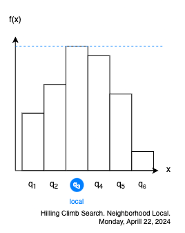
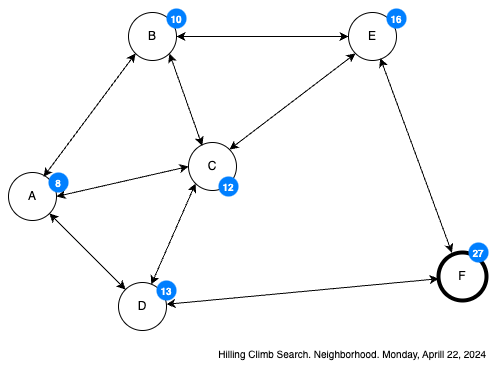
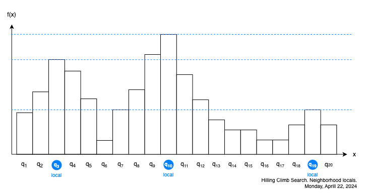

# Busqueda por ascenso de colina

Esta forma de busqueda local es realmente simple:

> Cambiarse de la vecindad del estado actual a la vecindad del estado hijo del actual cuya utilidad es mejor a la del actual, en caso de que ningun hijo tenga utilidad mejor a la actual, declarar al actual como el mejor estado y terminar.

Es decir que si nuestro arteria de utilidad es maximalista, siempre nos cambiamos al estado vecino del actual que tenga una utilidad mayor.



Comenzando en $q_1$ nos cambiamos a $q_2$ pues $f(q_2)>f(q_1)$ y $q_1 \in children(q_2)$.

De $q_2$ nos cambiamos a $q_3$ pues $f(q_3)>f(q_2)$ y $q_2 \in children(q_3)$.

De $q_3$ si nos queremos cambiar a $q_4$, vemos que  $f(q_4)<f(q_3)$, por lo cual, $q_3$ es el mejor estado que se encontró a partir de $q_1$.

Algo muy particular de la busqueda por ascenso de colina, y de todas las busquedas locales es que:

1. Solo se les indica un estado de inicio, oyes no hay estado meta, en todo caso este es lo que debemos encontrar, el mejor estado alcanzable desde el inicio.
2. Y por lo mismo, no importa el camino para llegar al mejor estado, solo importa encontrar el mejor estado

Esto es un claro contraste con las busquedas ciegas e informadas, en don de siempre se busca un camino desde el estado inicial al estado meta, o al menos un orden de visita. Si vamos a describir a ascenso de colina como un algoritmo, este sería como el siguiente:
```py
def hillClimbing(begin):
    current=begin
    complete=False
    while complete==False:
        neighbor=get_max_neighbor(current)
        if f(neighbor)>f(current):
            current=neighbor
        else
            complete=True
    return current
```
Supongamos nuestro problema de siempre:



La cantidad encima de cada estado es su utilidad ¿Cuál es el mejor estado alcanzable desde A?

| $current$ | $neighborhood$ | $max_neighborhood$ |
| --------- | -------------- | ------------------ |
| $A$       | $[B,C,D]$      | $D$                |
| $D$       | $[A,C,F]$      | $F$                |
| $F$       | $[D,E]$        | $E$                |

Ascenso de colina es una tecnica bastante simple, tiene sus ventajas y sus desventajas.

### Ventajas
1. Es muy rápida
2. Es simple, en el sentido de que no exige muchos recursos.

### Desventajas
1. Se "detiene" en el primer óptimo local que encuentra.



Si en este pequeño problema:
- Iniciamos en $q_1$ nos arroja a $q_3$ como el mejor estado
- Iniciamos en $q_{13}$ nos arroja a $q_{10}$ como el mejor estado.
- Iniciamos en $q_{21}$ y terminamos con $q_{19}$ como el mejor estado
