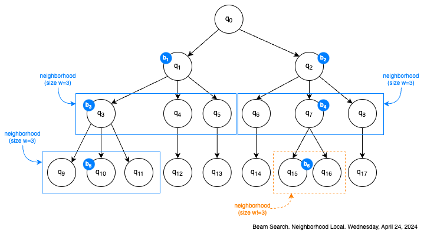

# Busqueda beam
La obtra de este estilo de búsqueda local es que en cualquier momento exista más de un camino de búsqueda (aunque el camino real no importa). La búsqueda beam define dos parámetros:

1. $b$, el factor de dispersión
2. $w$, el ancho de dispersión

El factor de disperción lo define cunatos caminos de búsqueda existen en cualquier momento y el ancho lo define algo como el tamaño de la vecindad.

Y es que la búsqueda beam se basa en la idea de e en cualquier momento existe no uno, si no $b$ búsquedas locales funcionando al mismo tiempo.



> Aquí se asume que b=2 y w=3

En cualquier momento, dados b "estados actuales" ${b_1, b_2,...b_n}$ se seleccionan los mejores $w$ hijos de cada uno, y con ello se forma la vecindad nueva. Luego, de esa vecindad se seleccionan los mejores estados y estos son los estados actuales. ¿Cuál es la ventaja de la busqueda beam?

> La ventaja de la búsqueda beam es que las vecindades se forman con los resultados de más de un "hijo" o camino de búsqueda, luego la oportunidad de que el óptimo local sea el óptimo global aumenta

- Algunos detalles detrás de la búsqueda beam, al inicio solo existe el estado de inicio $q_0$, que lo único que le queda por hacer es elegir a sus mejores hijos.
- Si en algún momento un estado tiene menos hijos que $w$, entonces solo los elige a todos.
- Y dado que labúsqueda beam es una búsqueda local ¿cómo se controla? Comúnmente la búsqueda beam solo repite su "iclo de búsqueda" una cantidad predeterminada de veces. En cada iteración verifica el mejor estado encontrado y lo registra, al final este mejor estado es la solución.

Así que si realmente necesitamos un algorítmo que describa a la búsqueda beam, este sería parecido al siguiente:

```py
def beam_search(begin, b, w, max_iterations):
    iterations_counter=0
    best=None
    f_best=-10.0
    neighborhood=get_neighborhood(begin)
    while iterations_counter <= max_iterations:
        max_f_neighbor, max_neighbor=get_max_neighbor(neighborhood)
        if max_f_neighbor > f_best:
            f_best=max_f_neighbor
            best=max_neighbor
        else:
            neighborhood=get_neighborhood(max_neighbor)


```