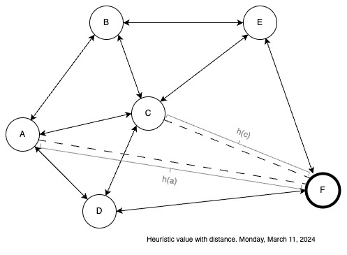

# Heurístic value of a state

A state has a cost, a value that depends on the followed path until get to him. The cost is a correct and justified uselfulness metric. But, the cost, is not the only way to evaluate the uselfulness of the state. We can use the heurístic value of a state q

> $h(q) \in \R \textrm{ is the heuristic value of the state }q$

So $h(q)$ measure how useful is  the state $q_i$, and it's established by:
- A personal linking
- A personal idea
- The advice of someone else.

# El valor heurístico de un estado

Un estado tiene un costo, algo que como ya vimos, depende del camino seguido para llegar a él. El costo como medida de utilidad está bien justificado y es formalmente correcto. Pero el costo no es la única forma para evaluar la utilidad de un estado, también existe el valor heurístico de un estado q:

> $h(q) \in \R \textrm{ es el valor heurístico del estado q}$

Así que $h(q)$ que mide cuando me resulta útil el estado $q_i$ surge de:
- Un gusto personal
- Una idea personal
- El consejo o tradición de alguien más

Y cuando usamos el valor heurístico $h(q)$ para evaluar la utilidad de un estado, estamos usando una medida un tanto "arbitraria" y no tan bien fundamentada, formalmente hablando, y sin embargo, funcionará. Lo único que si le vamos a exigir a nuestro valor eurístico $h(q)$ para que no sea tan arbitrario es que cumpla con lo siguiente:

> $h(q)=\begin{Bmatrix} 
  0 \textrm{ si } q \textrm{ es la meta } \\
  h(q)<h(r) \textrm{ si } q \textrm{ es un estado más cerca de la meta que r }
\end{Bmatrix}$
> Esta propiedad se llama la **desigualdad del triagulo**.

Esta le pone un mínimo de formalismo matemático a $h(q)$ que en principio no tiene ninguno. Una buena medida de valor heurístico la ofrece:

> La distancia en línea recta de un estado para con el estado meta es una excelente medida de valor heurístico.

Y es que la distancia en línea recta ($dlr$) cumple con la desigualdad del triángulo a la perfección:

Es claro aquí que:

$h(F)=dlr(F,F)=0$

$h(c)=dlr(C,F)=10$

$h(A)=dlr(A,F)=21$

Claramente, siendo F la meta:
- $h(F)=0$
- $h(A)>h(c)$ por que  $A$ está más lejos que $F$.

Un aspecto en donde $h(q)$, el valor heurúistico del estado $q$ es muy diferente de $g(q)$, el costo del estado $q$, es que:

> El valor heurístico $h(q)$ del estado $q$ es un valor constante.

Esto en contraste con $g(q)$, que depende del camino seguido desde el inicio para llegar a $q$. El valor $h(q)$ es fijo o constante porque no importa el camino para llegar a $q$, este se encuentra a la misma distancia para con la meta. A pesar de esto, normalmente $g(q)$ y $h(q)$ usan unidades de medida similares (distancia en kms, por ejemplo) porque ocasionalmente las agregamos (aunque no tienen porque utilizar siempre la misma medida de unidades).