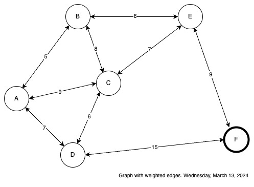
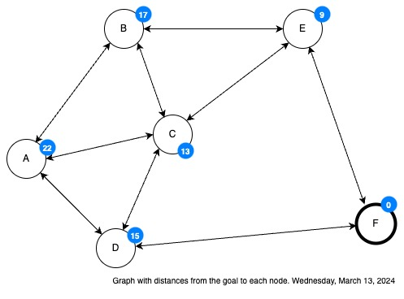

Sea el problema que hemos utilizado hasta ahora:

La candtidad indicada en cada arista indica el costo de cambiar entre los 2 estados que conecta y es un costo bidireccional

$g(D,F)=g(F,D)=15$

Entonces ¿cuál es el mejor camino para llegar a F desde A, usando primero por lo mejor? Recordemos que en primero por lo mejor, la utilidad de un estado es igual al costo de llegar a el desde el inicio
$f(q)=g(q) \textrm{ para } q \in Abiertos$

La demostración es la siguiente:

| Actual | Abiertos | Cerrados |
| - | - | - |
| - | $[A^A:0]$ | $[\ ]$ |
| $A^A:0$ | $[B^A:5,\ C^A:9,\ D^A:7]$ | $[A^A:0]$ |
| $B^A:5$ | $[C^A:9,\ D^A:7,\ E^B:15]$ | $[A^A:0,\ B^A:5]$ |
| $D^A:7$ | $[C^A:9,\ E^B:15,\ F^D:22]$ | $[A^A:0,\ B^A:5,\ D^A:7]$ |
| $C^A:9$ | $[E^B:15,\ F^D:22]$ | $[A^A:0,\ B^A:5,\ D^A:7,\ C^A:9]$ |
| $E^B:15$ | $[F^D:22]$ | $[A^A:0,\ B^A:5,\ D^A:7,\ C^A:9,\ E^B:15]$ |
| $F^D:22$ | $[]$ | $[A^A:0,\ B^A:5,\ D^A:7,\ C^A:9,\ E^B:15,\ F^D:22]$ |

Pero primero por lo mejor debe "regresar el mejor camino" (segín el) para alcanzar a F desde A, y este camino lo obtenemos desde la lista Cerrados *"retro propagando"* desde F:

$F \leftarrow D \leftarrow A$

Es decir que el mejor camino (según primero por lo mejor) para alcanzar a F desde A es:

$A \to D \to F$

Y ¿cuál será el mejor camino para llegar de A a F usando ahora la búsqueda avara?
Recordemos que la búsqueda avara usa como medida de utilidad a únicamente el valor heurístico de un estado. Es decir que:

$f(q)=h(q) \textrm{ para } q \in Abiertos$

&Y si vamos a utilizar a la distancia en línea recta para con el estado meta, para evaluar el valor heurístico del estado q:

$h(q)=dlr(q, meta)$

Entonces debemos indicar en el problema cuales son estas distancias:

Aquí las cantidades indicadas arriba de cada estado es su distancia en línea recta hacia F, el estado meta.

La búsqueda avara que usa como único criterio de optimalidad al valor heurístico, y siendo que este es constante, debería *"ahorrarse" la comparación de una nueva versión de un estado parra con una previa en Abiertos, para luego reemplazar si la nueva fuera mejor. Dado que el valor heurístico es constante

> Nunca una nueva versión de un estado es mejor a una previa en Abiertos.

Así que si nunca una nueva versión es mejor, no vale la pena la comparación, simplemente nunca la reemplazaremos.

| Actual | Abiertos | Cerrados |
| - | - | - |
| - | $[A^A:22]$ | $[\ ]$ |
| $A^A:22$ | $[B^A:17,\ C^A:13,\ D^A:15]$ | $[A^A:22]$ |
| $C^A:13$ | $[B^A:17,\ E^C:9]$ | $[A^A:22,\ C^A:13]$ |
| $E^C:9$ | $[B^A:17,\ D^A:15, F^E:0]$ | $[A^A:22,\ C^A:13,\ E^C:9]$ |
| $F^E:0$ | $[B^A:17,\ D^A:15]$ | $[A^A:22,\ C^A:13,\ E^C:9,\ F^E:0]$ |

La búsqueda avara también debe *"regresar"* el mejor camino hacia la meta, camino que debe formar *"retropropagando"* desde F (la meta) en la lista Cerrados.

$F \leftarrow E \leftarrow C \leftarrow A$

Es decir que el mejor camino (según primero por lo mejor) para alcanzar a F desde A es:

$A \to C \to E \to F$